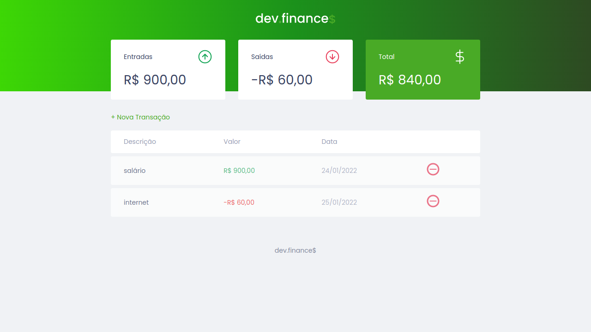

# dev.finances

O dev.finances é uma aplicação de controle financeiro, onde é possível cadastrar e excluir transações e ver o saldo de entrada e saída  
<https://liviaaraujo-dev.github.io/dev.finence/>

## Tecnologias

Esse projeto foi desenvolvido com as tecnologias:

- HTML
- CSS
- JavaScript

